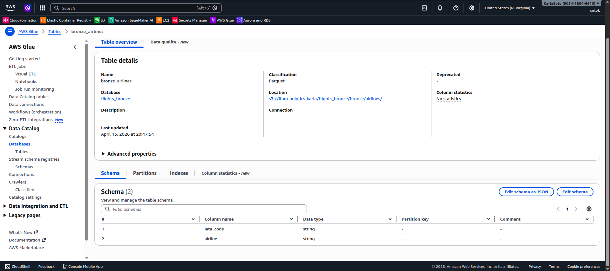
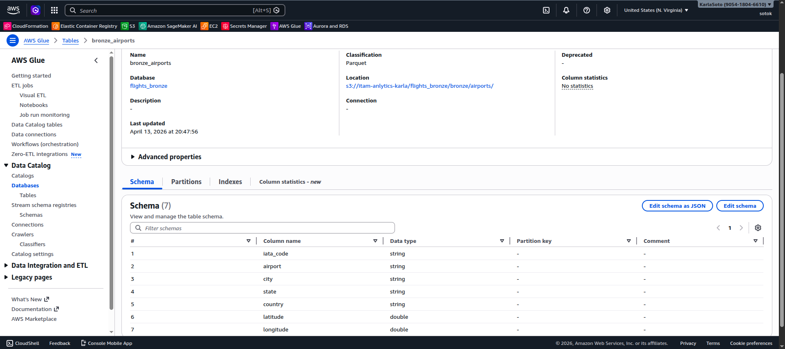
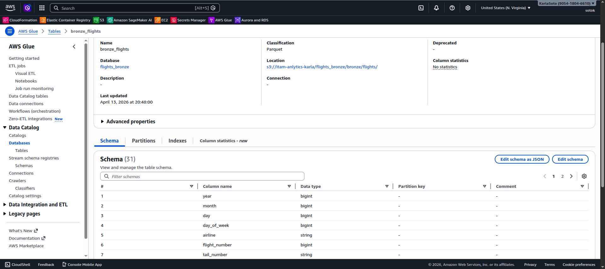
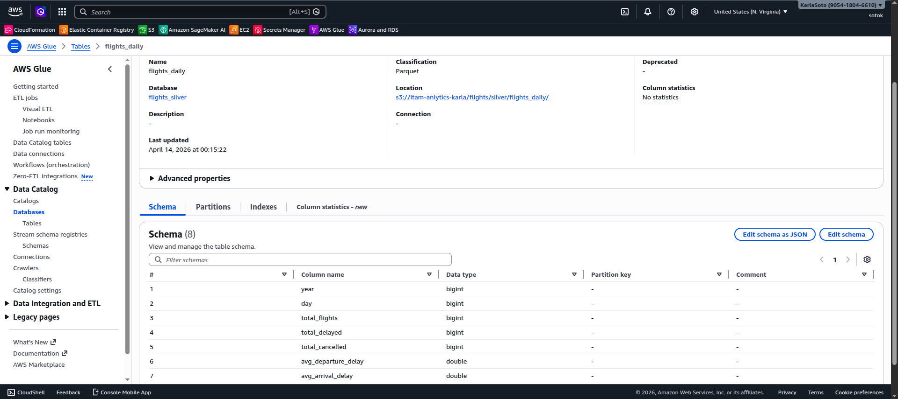
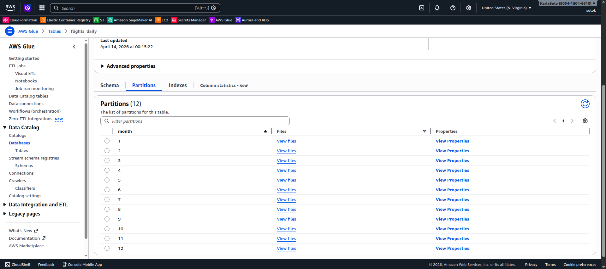
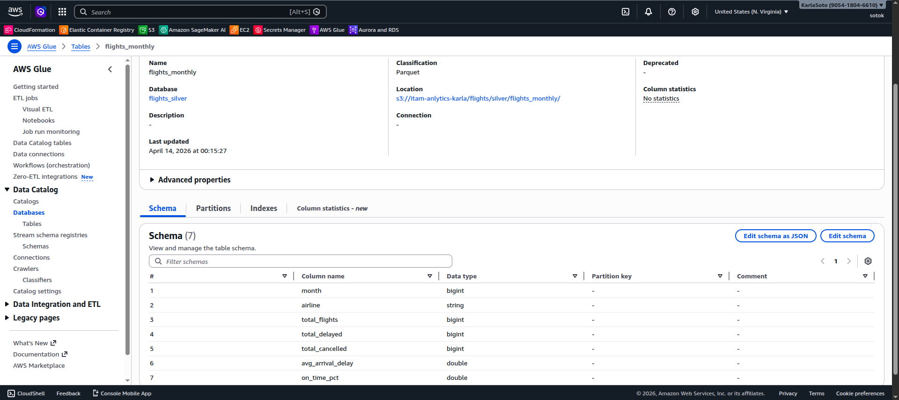
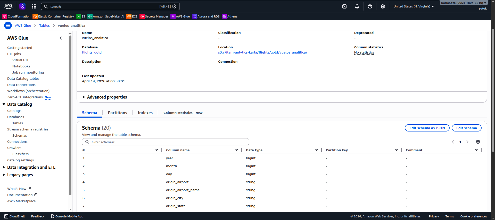

# Flights Data Engineering

## Project Objective and Description

This repository contains an **end-to-end Data Engineering pipeline for the 2015 U.S. flights dataset (~5.8M records)**, designed to transform raw CSV files into **analytical-ready data products** using a modern cloud-based architecture.

The objective of this project is to build a **reproducible, modular, and automatable data pipeline**, moving from raw data ingestion to curated datasets and aggregations, following best practices in production-grade data engineering.

The project implements a **Medallion Architecture (Bronze → Silver → Gold)** using AWS services, enabling scalable data processing, reliable transformations, and efficient querying for downstream analytics.

The pipeline includes:
- Modular **ETL pipeline** implemented as Python scripts (not notebooks)
- Data ingestion into **Amazon S3 (Bronze layer)** without transformations
- Data transformation and aggregation into **Parquet format (Silver layer)** using optimized storage (Snappy compression)
- Registration and management of tables in **AWS Glue Data Catalog**
- Query execution and analytical table creation using **Amazon Athena (Gold layer)**
- Partitioned datasets for efficient querying and scalability
- Structured and reproducible execution from the command line
- Logging, parameterization, and error handling following **production best practices**
- End-to-end workflow from **raw data to analytics-ready datasets**

## Repository Structure

```bash
.
├── etl
│   ├── bronze.py
│   ├── gold.py
│   └── silver.py
├── images
├── .gitignore
├── .python-version
├── pyproject.toml
├── README.md
└── uv.lock
```
---

## Installation and Setup

This project uses **`uv`** for Python environment and dependency management, ensuring reproducibility and fast dependency resolution.

### Requirements

To run this project, ensure you have the following installed:

- **Python 3.11+**
- **uv** (for environment and dependency management)
- **AWS CLI** (for interacting with S3 and AWS services)
- Access to an **AWS account** with permissions for:
  - Amazon S3
  - AWS Glue Data Catalog
  - Amazon Athena (for future steps)

### Optional (recommended)

- **JupyterLab (SageMaker Studio)** for executing commands and validating outputs
- **DBeaver** (for future PostgreSQL queries and analysis)

## How to Run the Pipeline

Run the ETL pipeline from the command line using the following commands:

### Run Bronze Layer

```bash
uv run python etl/bronze.py --bucket <your-bucket> --data-dir data/flights
```

### Run Silver Layer

```bash
uv run python etl/silver.py --bucket <your-bucket>
```

### Run Gold Layer

```bash
uv run python etl/gold.py --bucket <your-bucket>
```

---

## Scripts

### `etl/`

- **`bronze.py/`**
  Ingests raw CSV files into S3 and registers them in AWS Glue (Bronze layer).

- **`silver.py/`**
  Transforms data into Parquet format and builds aggregated tables (Silver layer).

- **`gold.py/`**
  Creates a curated analytical table by joining tables in Athena and saving into Parquet format (Gold layer).

---

### `images/`

Screenshots and visual evidence.

---

### `.gitignore/`

Excludes local data and environment artifacts

---

### `.python-version/`

Python version used for reproducibility

---

### `pyproject.toml/`

Project dependencies and configuration (managed with uv)

---

### `README.md/`

Project documentation

---

### `uv.lock/`

Locked dependencies for reproducible environments

---

## Git Workflow

We follow a structured Git workflow to ensure traceability, code quality, and collaborative development.

### Branch Structure

`main`
Stable production branch. Only reviewed and validated code is merged here.

`development`
Integration branch where completed features are merged after review. This is the base branch for new work.

**Feature Branches**
All changes are developed in separate branches created from `development`.

### Branch Naming Convention

Branches follow a prefix-based convention to clearly indicate the type of change:

- `feature/<short-description>` → New functionality
- `refactor/<short-description>` → Code improvements without changing behavior
- `bug/<short-description>` → Non-critical bug fixes
- `hotfix/<short-description>` → Critical production fixes

Examples:

```bash
feature/add-inference-logging
refactor/clean-training-pipeline
bug/fix-null-handling
hotfix/model-loading-error
```

### Commit Message Convention

Commits follow the same prefix structure as branch names to enable easy filtering and automated parsing.

Format:

type: short descriptive message

Examples:
```bash
feature: add month argument to inference pipeline
refactor: simplify preprocessing logic
bug: fix incorrect date parsing
hotfix: resolve model path issue
```

This convention helps extract structured information from commit history and improves readability.

### Development Process

1. Create a branch from development.
2. Implement changes and commit following the commit convention.
3. Push the branch to the remote repository.
4. Open a Pull Request (PR) targeting development.
5. Team members review and test the changes.
6. Once approved, the branch is merged into development.
7. After a development cycle is complete and all changes are validated, development is merged into main.
8. The cycle then restarts from development.

This workflow ensures isolated development, structured collaboration, controlled releases, and a clean production branch.

---

## Main Dependencies

This project relies on the following Python libraries:

- pandas – data manipulation and transformation
- numpy – numerical computing
- pyarrow – efficient columnar storage and Parquet I/O
- awswrangler – high-level interface for AWS services (S3, Glue, Athena)
- boto3 – low-level interaction with AWS services (S3, Glue Data Catalog)
- argparse – command-line argument parsing for ETL scripts
- logging – structured logging for pipeline execution and monitoring
- python-dateutil – date handling for aggregations

---

## Screenshots

### ETL - Bronze




### ETL - Silver





### ETL - Gold

